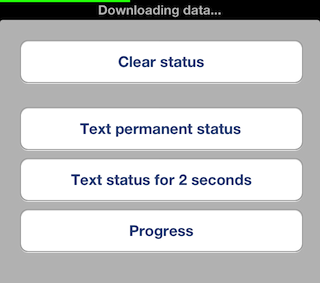

# WTStatusBar

iPhone/iPad status bar with text (and optionally Foursquare-like progress bar) display.

This looks like:

## Requirements
iOS5 or later, ARC

## Usage

1. Include `WTStatusBar.h` in your project
2. Call `[WTStatusBar setStatusText:]` or `[WTStatusBar setStatusText: animated:]` when you need to show status information. Progress value is cleared on each setStatusText call.
3. Call `[WTStatusBar setStatusText: timeout: animated:]` if you want to automatically hide status after timeout (like showing information message).
4. Call `[WTStatusBar setProgress:]` or `[WTStatusBar setProgress: animated:]` when you want to change progress bar value. These calls are ignored if status bar is not shown.
5. Call `[WTStatusBar clearStatus]` or `[WTStatusBar clearStatusAnimated:]` when you want to hide status.

## License
MIT
